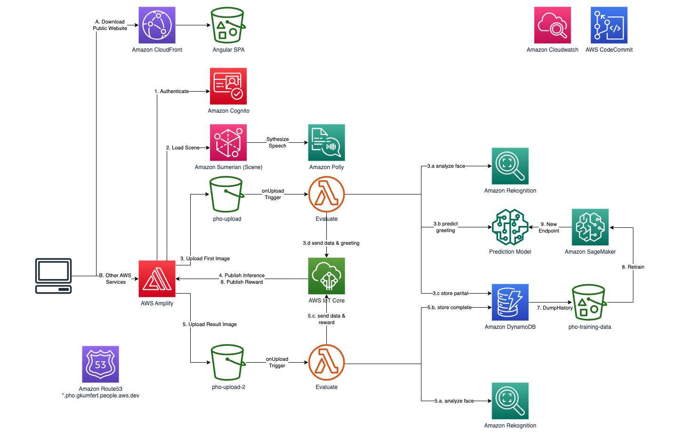
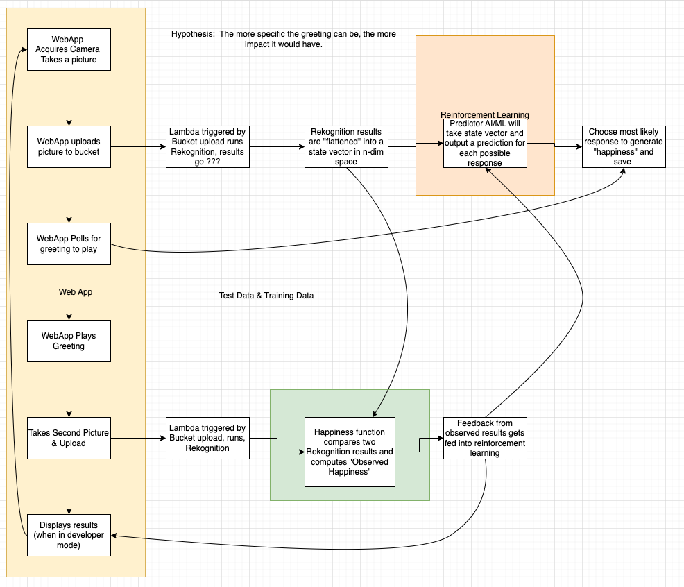

# personalized-happiness-optimizer
Personalized Happiness Optimizer (PHO) is a virtual assistant that can be applied in most places of business like welcoming customers in a store or restaurant, or helping customers in a help desk in public places like like shopping malls or airports. The main objective of PHO is to simply delight customers in places of business.  

PHO uses image recognition to analyze the person it is interacting with and using artificial intelligence it can issue a greeting to elevate the mood of the person. It doesn't just stop there, instead based on the customer reaction, PHO analyzes how well it did in terms of helping the customer - be it answering a question or simply greeting someone. So, it uses Reinforcement Learning to learn and improve itself over time.  

The AWS services used in PHO is shown in the architecture diagram below
  

PHO uses a camera as the input device to capture an image of the person it is interacting with. It further uses Amazon Rekognition to analyze the image and learn about attributes like gender, age, facial features, any recognizable brands or objects they might be wearing or carrying, just to name a few. It then hands off this information to a Sagemaker endpoint or a trained machine learning model which returns the most appropriate response or greeting for the customer in this context. Once the greeting is issued or displayed, PHO analyzed the customer reaction again using Rekognition and captures relevant information like input parameters like key attributes that were used to select a greeting, the actual greeting that was issued, and the customer reaction - which is then used to retrain the model. The images captured are used only for analysis and deleted right after.  

The process flow is shown in the image below

This was featured in 2021 Builder's Fair at Re:Invent. The screen caps demonstrate the workflow a user would go through

A USB camera attached to a computer takes an initial picture which is securely uploaded to Amazon S3 and tags it with critical data used in the workflow by other services. An S3 event notification triggers a Lambda [function](src/pho.py) that extracts metadata and sends it to Rekognition for analysis.  

Analysis returned by Rekognition is used to make a prediction on a greeting which is issued by the Sumerian Host Avatar. A second photo is then taken a few seconds after issuing the greeting -> S3 event triggers Lambda -> Metadata extracted is sent to Rekognition.  

The analysis returned by Rekognition on the second image is compared with that of the first image to do a comparative sentiment analysis, a happiness score is calculated based on the confidence score returned by Rekognition, and the analyses results with the greeting is stored in DynamoDB.  

Finally, the model is retrained to continually improve the efficacy of the greeting issued and to improve customer sentiment over time.